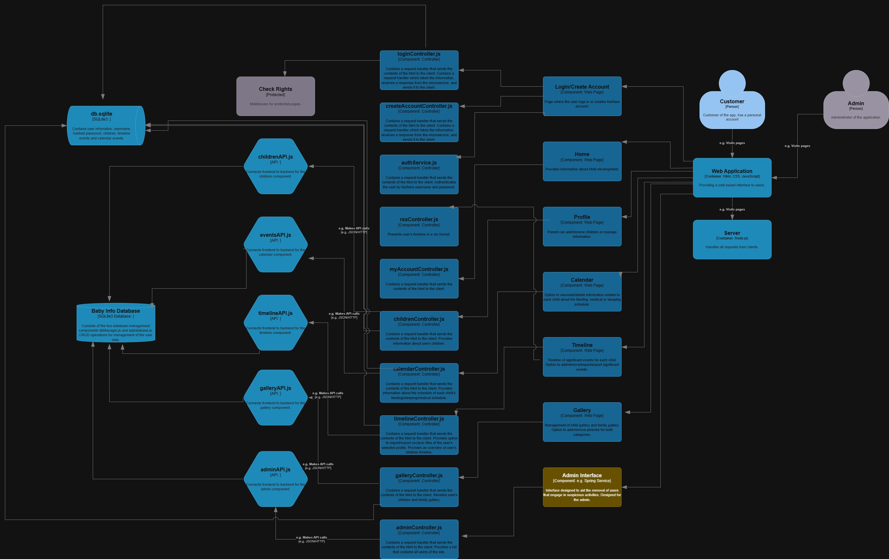

# 🍼 Baby Info On Web

Proiectul **Baby Info Web** isi propune sa creeze o platforma web completa, dedicata familiilor si cuplurilor, pentru a gestiona in mod eficient toate resursele si informatiile necesare legate de ingrijirea copiilor. De la programul de somn si alimentație, la monitorizarea cresterii si dezvoltării, platforma va centraliza informatii esentiale pentru a sprijini parintii in aceasta calatorie.

---

## 📚 Autori:

* 👨‍💻 Andrei Bogdan
* 👨‍💻 Hariton Cosmin

---

## 🖥️ Prezentare Video:

https://drive.google.com/file/d/1ibOwpqIWwNwmVsK7l1yUzs9DlxPp9nIk/view
---

## 📄 Documentație:
https://drive.google.com/file/d/1mjcBkAwtQJHQvZu_AYWBeBgShOvIF-UN/view

## ⚙️ Arhitectură Backend:

## 📋 Cerințe Proiect:

https://profs.info.uaic.ro/andrei.panu/courses/web/lab/webprojects.html
---

## 🔑 Cont Administrator:

* **Utilizator:** administrator
* **Parolă:** administrator1234A.